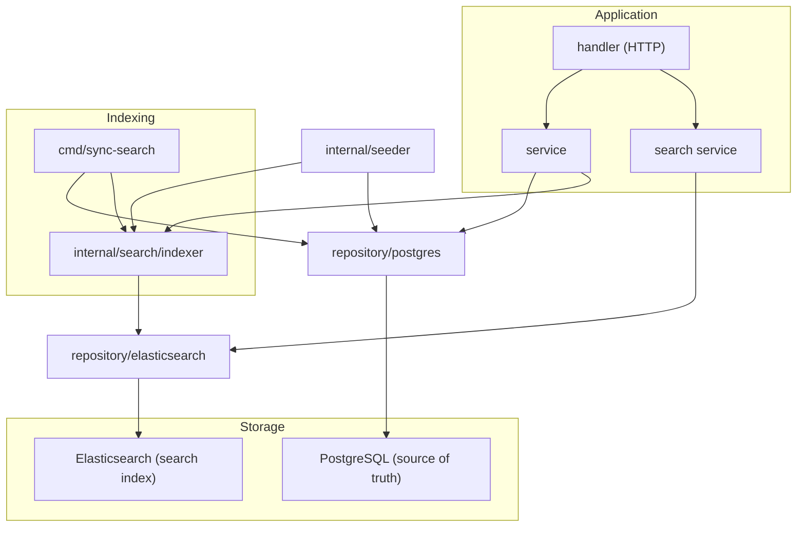
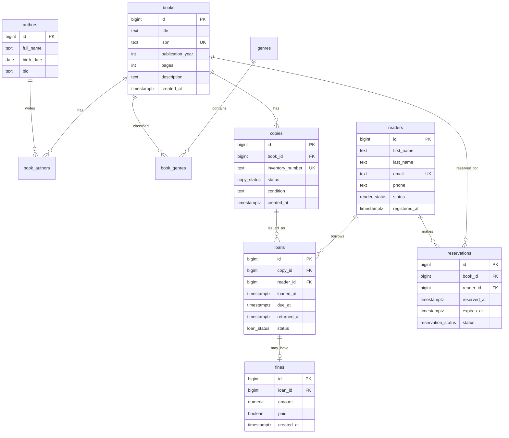
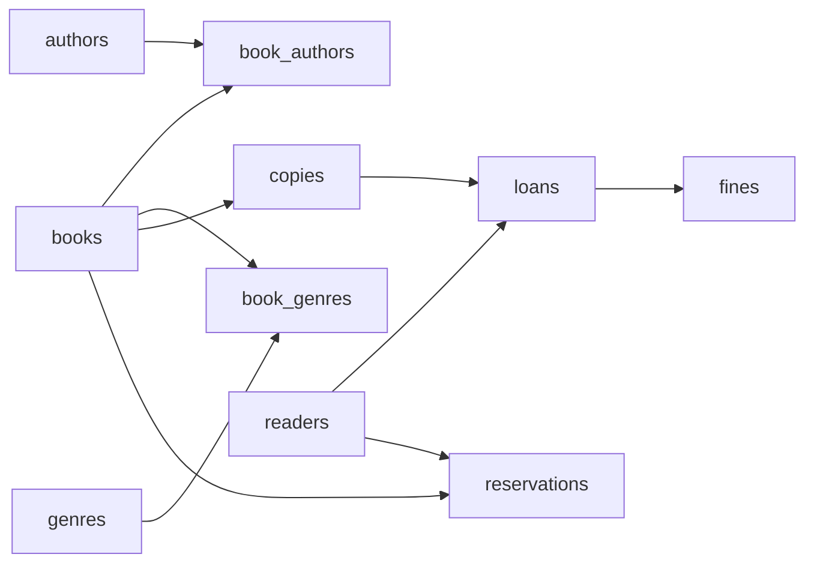
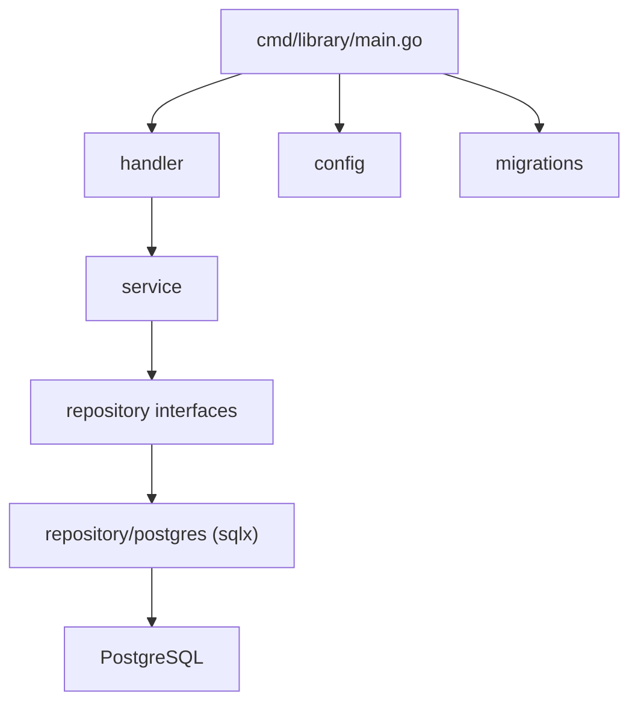
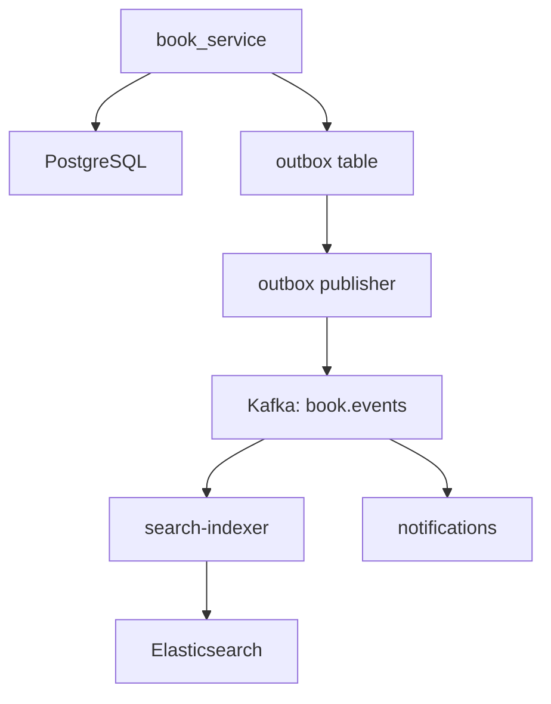

# Архитектура проекта db-proj-library

Библиотечная система на **Go + PostgreSQL + sqlx** с отдельным пакетом генерации тестовых данных, поиском через **Elasticsearch** (планируется) и заделом под **Kafka** (опционально, на будущее).

---

## Обзор

PostgreSQL — **источник истины**. Elasticsearch — **поисковый индекс** для каталога книг. Данные в ES денормализуются и синхронизируются из PG, но не заменяют реляционную БД.



---

## Схема БД

Каталог (`books`) отделён от фонда (`copies`). Выдачи идут через `loans`, читатели — в `readers`.



### Таблицы

| Таблица | Назначение |
|---|---|
| `authors`, `book_authors` | M:N — у книги может быть несколько авторов |
| `genres`, `book_genres` | M:N — жанры и категории |
| `books` | Каталог: метаданные книги (ISBN уникален) |
| `copies` | Физические экземпляры с инвентарным номером |
| `readers` | Читатели библиотеки |
| `loans` | Выдачи и возвраты |
| `reservations` | Бронь книги, когда все экземпляры заняты |
| `fines` | Штрафы за просрочку |

### ENUM-типы

```sql
CREATE TYPE copy_status AS ENUM ('available', 'on_loan', 'reserved', 'lost', 'maintenance');
CREATE TYPE reader_status AS ENUM ('active', 'blocked', 'inactive');
CREATE TYPE loan_status AS ENUM ('active', 'returned', 'overdue');
CREATE TYPE reservation_status AS ENUM ('pending', 'fulfilled', 'cancelled', 'expired');
```

### Ключевые ограничения

```sql
-- Один экземпляр — одна активная выдача
CREATE UNIQUE INDEX loans_active_copy_idx
    ON loans (copy_id) WHERE status = 'active';

-- Читатель не может иметь две активные брони одной книги
CREATE UNIQUE INDEX reservations_active_reader_book_idx
    ON reservations (reader_id, book_id)
    WHERE status = 'pending';

-- Даты логичны
ALTER TABLE loans ADD CONSTRAINT loans_dates_check
    CHECK (due_at > loaned_at AND (returned_at IS NULL OR returned_at >= loaned_at));
```

### Индексы

- `copies(book_id, status)` — поиск свободных экземпляров
- `loans(reader_id, status)` — активные выдачи читателя
- `loans(due_at) WHERE status = 'active'` — просроченные выдачи
- `books USING gin(to_tsvector('russian', title))` — полнотекстовый поиск в PG (резервный)

### Порядок вставки (seed)



---

## Структура проекта

```
db-proj-library/
├── cmd/
│   ├── library/
│   │   └── main.go                 # основное приложение (HTTP API)
│   ├── seed/
│   │   └── main.go                 # CLI: наполнение БД тестовыми данными
│   └── sync-search/
│       └── main.go                 # полная переиндексация PG → ES
│
├── internal/
│   ├── config/
│   │   └── config.go               # DSN, ES URL, лимиты, таймауты
│   │
│   ├── domain/                     # сущности, enum, доменные ошибки
│   │   ├── author.go
│   │   ├── book.go
│   │   ├── copy.go
│   │   ├── reader.go
│   │   ├── loan.go
│   │   ├── reservation.go
│   │   ├── search.go               # SearchQuery, SearchResult, BookDocument
│   │   └── errors.go
│   │
│   ├── repository/
│   │   ├── interfaces.go           # интерфейсы репозиториев
│   │   ├── postgres/               # sqlx-реализация
│   │   │   ├── db.go
│   │   │   ├── author_repo.go
│   │   │   ├── book_repo.go
│   │   │   ├── copy_repo.go
│   │   │   ├── reader_repo.go
│   │   │   └── loan_repo.go
│   │   └── elasticsearch/          # go-elasticsearch (планируется)
│   │       ├── client.go
│   │       ├── book_index.go
│   │       └── book_search.go
│   │
│   ├── search/                     # слой индексации
│   │   ├── indexer.go              # BookIndexer: Index, Delete, BulkIndex
│   │   ├── mapper.go               # domain.Book → BookDocument
│   │   └── mapping.go              # JSON mapping индекса ES
│   │
│   ├── service/                    # бизнес-логика
│   │   ├── book_service.go
│   │   ├── loan_service.go
│   │   └── search_service.go
│   │
│   ├── handler/                    # HTTP handlers
│   │   ├── book_handler.go
│   │   ├── loan_handler.go
│   │   └── search_handler.go
│   │
│   ├── events/                     # доменные события (задел под Kafka)
│   │   ├── book_created.go
│   │   ├── loan_issued.go
│   │   └── publisher.go            # interface EventPublisher
│   │
│   ├── faker/                      # генерация fake-данных (без SQL)
│   │   ├── faker.go
│   │   ├── author.go
│   │   ├── book.go
│   │   ├── copy.go
│   │   ├── reader.go
│   │   ├── loan.go
│   │   └── options.go
│   │
│   └── seeder/                     # оркестрация записи в БД
│       ├── seeder.go
│       ├── config.go
│       └── graph.go
│
├── migrations/
│   ├── 000001_init.up.sql
│   └── 000001_init.down.sql
│
├── MD/
│   └── architecture.md
│
├── docker-compose.yml
└── go.mod
```

---

## Слоистая архитектура

Зависимости идут только вниз: `handler` → `service` → `repository` → `domain`.



### Роли слоёв

| Слой | Ответственность | Чего не делает |
|---|---|---|
| `domain` | Структуры, enum, доменные ошибки | SQL, HTTP, генерация данных |
| `repository/postgres` | SQL-запросы через sqlx, маппинг в domain | Бизнес-правила |
| `repository/elasticsearch` | Низкоуровневые запросы к ES | Бизнес-правила |
| `search` | Маппинг и индексация документов | HTTP, SQL |
| `service` | Бизнес-правила: выдача, возврат, блокировка | SQL, HTTP |
| `handler` | HTTP, валидация входа, коды ответов | SQL, бизнес-логика |
| `faker` | Генерация `domain.*` со случайными полями | SQL, транзакции |
| `seeder` | Порядок и объёмы вставки, связи M:N | HTTP, бизнес-правила |

### Транзакции

Критичные операции (выдача, возврат, бронь) выполняются в транзакции:

1. Проверка статуса читателя
2. `SELECT ... FOR UPDATE` на экземпляр
3. Создание записи `loan`
4. Обновление статуса `copy`

---

## Пакет генерации данных (faker + seeder)

### Разделение ответственности

```
faker     →  "как выглядит одна запись"
seeder    →  "сколько и в каком порядке, с какими связями"
repository → "как записать в PostgreSQL"
cmd/seed  →  "запустить из CLI"
```

| Пакет | Что делает |
|---|---|
| `internal/faker` | Генерирует `domain.*` через gofakeit; воспроизводимость через seed |
| `internal/seeder` | Вызывает faker, связывает ID, пишет в БД, опционально индексирует в ES |
| `cmd/seed` | Парсит флаги, подключается к БД, запускает seeder |

### Что генерирует faker

| Таблица | Faker-поля | Заметки |
|---|---|---|
| `authors` | `full_name`, `birth_date`, `bio` | — |
| `genres` | фиксированный список + случайные | «Фантастика», «Детектив»... |
| `books` | `title`, `isbn`, `publication_year`, `pages`, `description` | ISBN уникален |
| `book_authors` | случайные пары book↔author | 1–3 автора на книгу |
| `book_genres` | случайные пары book↔genre | 1–2 жанра на книгу |
| `copies` | `inventory_number`, `status`, `condition` | 1–5 экземпляров на книгу |
| `readers` | `first_name`, `last_name`, `email`, `phone`, `status` | email уникален |
| `loans` | `loaned_at`, `due_at`, `returned_at`, `status` | только для доступных/выданных копий |
| `reservations` | `reserved_at`, `expires_at`, `status` | опционально |
| `fines` | `amount`, `paid` | только для просроченных loans |

### Режимы seed

| Режим | Поведение |
|---|---|
| `seed` | Вставка в пустую БД после миграций |
| `reset` | `TRUNCATE ... CASCADE` → seed |
| `append` | Добавить данные без очистки (уникальные ISBN/email) |

### Запуск

```bash
go run ./cmd/seed --authors 50 --books 200 --readers 100 --seed 42
```

---

## Elasticsearch

### Принцип

- PG — источник истины
- ES — денормализованный поисковый индекс
- Один индекс `books` для полнотекстового поиска по каталогу

### Документ индекса

```go
type BookDocument struct {
    ID              int64     `json:"id"`
    Title           string    `json:"title"`
    ISBN            string    `json:"isbn"`
    Description     string    `json:"description"`
    PublicationYear int       `json:"publication_year"`
    Authors         []string  `json:"authors"`
    Genres          []string  `json:"genres"`
    AvailableCopies int       `json:"available_copies"`
    IndexedAt       time.Time `json:"indexed_at"`
}
```

### Что индексируется

| Сущность | PostgreSQL | Elasticsearch |
|---|---|---|
| `books` + authors + genres | ✅ | ✅ |
| `copies` | ✅ | частично (`available_copies` в документе) |
| `readers` | ✅ | ❌ |
| `loans` | ✅ | ❌ |
| `reservations` | ✅ | ❌ |

### Потоки данных

**Создание книги (runtime):**

```
handler → book_service → PG (INSERT) → indexer → ES (PUT /books/_doc/{id})
```

**Поиск:**

```
search_handler → search_service → elasticsearch (multi_match) → SearchResult
```

**Seed + индексация:**

```
seeder → PG (bulk insert) → indexer.BulkIndex() → ES
```

**Полная переиндексация:**

```bash
go run ./cmd/sync-search --recreate-index
go run ./cmd/sync-search
```

### Интерфейсы

```go
type SearchRepository interface {
    Index(ctx context.Context, doc domain.BookDocument) error
    BulkIndex(ctx context.Context, docs []domain.BookDocument) error
    Delete(ctx context.Context, bookID int64) error
    Search(ctx context.Context, query domain.SearchQuery) (*domain.SearchResult, error)
}

type BookIndexer interface {
    Index(ctx context.Context, book domain.Book) error
    BulkIndex(ctx context.Context, books []domain.Book) error
    Delete(ctx context.Context, bookID int64) error
}
```

---

## Kafka (опционально, на будущее)

На старте **не требуется**. Синхронная индексация через `indexer` и fallback через `cmd/sync-search` достаточны для монолита с умеренной нагрузкой.

### Когда имеет смысл подключить

| Сценарий | Зачем Kafka |
|---|---|
| PG → ES асинхронно | API не ждёт ES |
| ES недоступен | События в топике, consumer переиндексирует позже |
| Несколько consumer'ов | Поиск, уведомления, аналитика, аудит |
| Микросервисы | Разделение books / loans / search |

### Рекомендуемый подход: Transactional Outbox



1. В одной транзакции с `INSERT book` — запись в `outbox_events`
2. Worker (`cmd/outbox-relay`) читает outbox и публикует в Kafka
3. Consumer (`cmd/search-consumer`) индексирует в ES

### Задел в коде (этап 1)

```go
type EventPublisher interface {
    Publish(ctx context.Context, event Event) error
}

// NoopPublisher       — заглушка
// SyncIndexerPublisher — сразу вызывает indexer (без Kafka)
// KafkaPublisher       — подключается на этапе 3
```

Структура на будущее:

```
internal/
├── events/
│   ├── book_created.go
│   ├── loan_issued.go
│   └── publisher.go
├── outbox/                    # этап 3
│   ├── store.go
│   └── relay.go
└── consumer/                  # этап 3
    ├── search_indexer.go
    └── notifications.go

cmd/
├── outbox-relay/
└── search-consumer/
```

---

## Docker

```yaml
services:
  postgres:
    image: postgres:16
    environment:
      POSTGRES_DB: library
      POSTGRES_USER: library
      POSTGRES_PASSWORD: library
    ports:
      - "5432:5432"

  elasticsearch:
    image: docker.elastic.co/elasticsearch/elasticsearch:8.13.0
    environment:
      - discovery.type=single-node
      - xpack.security.enabled=false
      - "ES_JAVA_OPTS=-Xms512m -Xmx512m"
    ports:
      - "9200:9200"
```

---

## Зависимости

```go
require (
    github.com/jmoiron/sqlx v1.4.0
    github.com/lib/pq v1.10.9
    github.com/brianvoe/gofakeit/v7 v7.2.1
    github.com/elastic/go-elasticsearch/v8 v8.13.0
    github.com/golang-migrate/migrate/v4 v4.18.0
)
```

---

## Этапы реализации

| Этап | Что делаем |
|---|---|
| **1** | Миграции, domain, repository/postgres, config, docker-compose |
| **2** | faker, seeder, cmd/seed |
| **3** | service, handler, cmd/library (HTTP API) |
| **4** | repository/elasticsearch, search/indexer, cmd/sync-search |
| **5** | search_service, GET /search |
| **6** | Автоиндексация в book_service при create/update/delete |
| **7** (опционально) | events, outbox, Kafka, async consumers |

### MVP (этап 1–3)

- `books`, `copies`, `readers`, `loans`
- CRUD книг и читателей
- Выдача / возврат
- Seed через faker
- CLI или простой HTTP API

### Полная версия (этап 4–6)

- `authors`, `genres`, `reservations`, `fines`
- Полнотекстовый поиск через Elasticsearch
- Bulk-индексация при seed

### Расширение (этап 7)

- Kafka + Transactional Outbox
- Асинхронная индексация
- Уведомления, аудит
